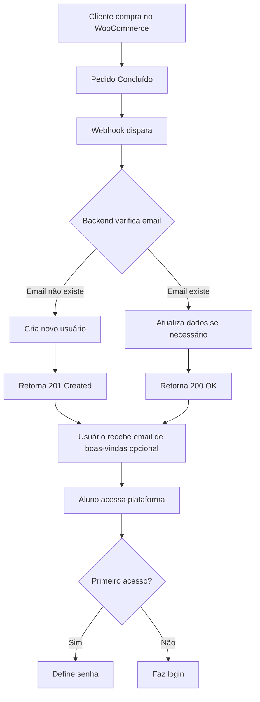

# 🔗 Webhook WooCommerce - Guia Completo de Integração

## 📋 Sumário
1. [Endpoint do Webhook](#endpoint-do-webhook)
2. [Formato dos Dados](#formato-dos-dados)
3. [Como Configurar no WooCommerce](#como-configurar-no-woocommerce)
4. [Testando o Webhook](#testando-o-webhook)
5. [Exemplos de Requisições](#exemplos-de-requisições)
6. [Códigos de Resposta](#códigos-de-resposta)
7. [Troubleshooting](#troubleshooting)

---

## 🎯 Endpoint do Webhook

### **URL de Produção:**
```
https://gconcursos-api.onrender.com/api/webhook/woocommerce
```

### **URL de Teste:**
```
https://gconcursos-api.onrender.com/api/webhook/test
```

### **Método HTTP:**
```
POST
```

### **Headers:**
```
Content-Type: application/json
```

---

## 📦 Formato dos Dados

### **Corpo da Requisição (JSON):**

```json
{
  "email": "aluno@example.com",
  "full_name": "Nome Completo do Aluno",
  "subscription_type": "Aluno Clube do Pedrão"
}
```

### **Campos:**

| Campo | Tipo | Obrigatório | Descrição | Valores Aceitos |
|-------|------|-------------|-----------|-----------------|
| `email` | String | ✅ Sim | Email do aluno | Formato válido de email |
| `full_name` | String | ✅ Sim | Nome completo do aluno | Qualquer texto |
| `subscription_type` | String | ❌ Não | Tipo de assinatura | "Professor"<br>"Aluno Clube dos Cascas"<br>"Aluno Clube do Pedrão" |

**Nota:** Se `subscription_type` não for enviado, o padrão será **"Aluno Clube do Pedrão"**.

---

## 🛠️ Como Configurar no WooCommerce

### **Opção 1: Plugin WooCommerce Webhooks**

1. **Acesse o WordPress Admin:**
   ```
   WooCommerce → Configurações → Avançado → Webhooks
   ```

2. **Clique em "Adicionar Webhook"**

3. **Configure os seguintes campos:**

   | Campo | Valor |
   |-------|-------|
   | **Nome** | Novo Aluno G-Concursos |
   | **Status** | ✅ Ativo |
   | **Tópico** | Pedido criado (order.created) |
   | **URL de Entrega** | `https://gconcursos-api.onrender.com/api/webhook/woocommerce` |
   | **Segredo** | (deixe em branco ou use um token) |
   | **Versão da API** | WP REST API Integration v3 |

4. **Salvar Webhook**

---

### **Opção 2: Código PHP no `functions.php`**

Adicione o seguinte código no arquivo `functions.php` do seu tema:

```php
<?php
/**
 * Webhook para G-Concursos
 * Envia dados do aluno quando um pedido é concluído
 */

add_action('woocommerce_order_status_completed', 'gconcursos_send_webhook', 10, 1);

function gconcursos_send_webhook($order_id) {
    // Buscar dados do pedido
    $order = wc_get_order($order_id);
    
    // Buscar dados do cliente
    $email = $order->get_billing_email();
    $first_name = $order->get_billing_first_name();
    $last_name = $order->get_billing_last_name();
    $full_name = trim($first_name . ' ' . $last_name);
    
    // Detectar tipo de assinatura baseado no produto
    $subscription_type = 'Aluno Clube do Pedrão'; // Padrão
    
    foreach ($order->get_items() as $item) {
        $product_name = $item->get_name();
        
        // Ajuste conforme seus produtos
        if (stripos($product_name, 'cascas') !== false) {
            $subscription_type = 'Aluno Clube dos Cascas';
        } elseif (stripos($product_name, 'pedrão') !== false || stripos($product_name, 'pedrao') !== false) {
            $subscription_type = 'Aluno Clube do Pedrão';
        } elseif (stripos($product_name, 'professor') !== false) {
            $subscription_type = 'Professor';
        }
    }
    
    // Preparar dados
    $data = array(
        'email' => $email,
        'full_name' => $full_name,
        'subscription_type' => $subscription_type
    );
    
    // URL do webhook
    $webhook_url = 'https://gconcursos-api.onrender.com/api/webhook/woocommerce';
    
    // Enviar requisição
    $response = wp_remote_post($webhook_url, array(
        'method' => 'POST',
        'headers' => array('Content-Type' => 'application/json'),
        'body' => json_encode($data),
        'timeout' => 15
    ));
    
    // Log (opcional - para debug)
    if (is_wp_error($response)) {
        error_log('G-Concursos Webhook Error: ' . $response->get_error_message());
    } else {
        error_log('G-Concursos Webhook Success: ' . wp_remote_retrieve_body($response));
    }
}
```

---

### **Opção 3: Plugin Zapier/Make.com**

1. **Instale o plugin Zapier/Make.com no WordPress**
2. **Crie um Zap/Scenario:**
   - **Trigger:** WooCommerce - Nova Compra
   - **Action:** Webhook - POST Request
3. **Configure o Webhook:**
   - URL: `https://gconcursos-api.onrender.com/api/webhook/woocommerce`
   - Method: POST
   - Data:
     ```json
     {
       "email": "{{customer_email}}",
       "full_name": "{{customer_first_name}} {{customer_last_name}}",
       "subscription_type": "Aluno Clube do Pedrão"
     }
     ```

---

## 🧪 Testando o Webhook

### **1. Teste Simples (Endpoint de Teste)**

```bash
curl -X POST https://gconcursos-api.onrender.com/api/webhook/test \
  -H "Content-Type: application/json" \
  -d '{
    "email": "teste@example.com",
    "full_name": "Aluno Teste",
    "subscription_type": "Aluno Clube do Pedrão"
  }'
```

**Resposta esperada:**
```json
{
  "message": "Webhook está funcionando!",
  "timestamp": "2024-12-18T12:00:00.000Z",
  "body": {
    "email": "teste@example.com",
    "full_name": "Aluno Teste",
    "subscription_type": "Aluno Clube do Pedrão"
  }
}
```

---

### **2. Teste Real (Criar Aluno)**

```bash
curl -X POST https://gconcursos-api.onrender.com/api/webhook/woocommerce \
  -H "Content-Type: application/json" \
  -d '{
    "email": "novamente@example.com",
    "full_name": "João Silva",
    "subscription_type": "Aluno Clube dos Cascas"
  }'
```

**Resposta de sucesso (novo usuário):**
```json
{
  "message": "Usuário cadastrado com sucesso",
  "user": {
    "id": "uuid-aqui",
    "email": "novamente@example.com",
    "full_name": "João Silva",
    "role": "user",
    "subscription_type": "Aluno Clube dos Cascas",
    "first_login": true,
    "created_at": "2024-12-18T12:00:00.000Z"
  }
}
```

**Resposta se usuário já existe:**
```json
{
  "message": "Usuário já existe",
  "user": {
    "id": "uuid-aqui",
    "email": "novamente@example.com",
    "full_name": "João Silva",
    "subscription_type": "Aluno Clube dos Cascas"
  },
  "updated": false
}
```

---

## 📊 Códigos de Resposta HTTP

| Código | Status | Descrição |
|--------|--------|-----------|
| **201** | Created | ✅ Novo usuário criado com sucesso |
| **200** | OK | ✅ Usuário já existe (atualizado se necessário) |
| **400** | Bad Request | ❌ Campos obrigatórios faltando ou formato inválido |
| **409** | Conflict | ⚠️ Email já cadastrado (conflito) |
| **500** | Internal Server Error | ❌ Erro no servidor |

---

## 📝 Exemplos de Requisições

### **Exemplo 1: Clube do Pedrão**

```bash
curl -X POST https://gconcursos-api.onrender.com/api/webhook/woocommerce \
  -H "Content-Type: application/json" \
  -d '{
    "email": "aluno.pedrao@example.com",
    "full_name": "Maria Santos",
    "subscription_type": "Aluno Clube do Pedrão"
  }'
```

---

### **Exemplo 2: Clube dos Cascas**

```bash
curl -X POST https://gconcursos-api.onrender.com/api/webhook/woocommerce \
  -H "Content-Type: application/json" \
  -d '{
    "email": "aluno.cascas@example.com",
    "full_name": "Pedro Oliveira",
    "subscription_type": "Aluno Clube dos Cascas"
  }'
```

---

### **Exemplo 3: Professor**

```bash
curl -X POST https://gconcursos-api.onrender.com/api/webhook/woocommerce \
  -H "Content-Type: application/json" \
  -d '{
    "email": "professor@example.com",
    "full_name": "Prof. Carlos Lima",
    "subscription_type": "Professor"
  }'
```

---

### **Exemplo 4: Sem subscription_type (usa padrão)**

```bash
curl -X POST https://gconcursos-api.onrender.com/api/webhook/woocommerce \
  -H "Content-Type: application/json" \
  -d '{
    "email": "aluno@example.com",
    "full_name": "Ana Costa"
  }'
```
→ Será cadastrado como **"Aluno Clube do Pedrão"**

---

## 🚨 Troubleshooting

### **Problema: Webhook não está sendo chamado**

**Soluções:**
1. Verifique se o webhook está ativo no WooCommerce
2. Verifique se a URL está correta (com https://)
3. Teste manualmente com curl
4. Veja os logs do WooCommerce:
   ```
   WooCommerce → Status → Logs → Selecione webhook-delivery
   ```

---

### **Problema: Erro 400 - Campos obrigatórios faltando**

**Causa:** Email ou nome não estão sendo enviados

**Solução:**
- Verifique se o pedido tem email e nome do cliente
- Verifique o formato do JSON enviado
- Teste com curl para validar os dados

---

### **Problema: Erro 500 - Erro no servidor**

**Causa:** Erro no backend ou banco de dados

**Solução:**
1. Verifique os logs do backend no Render
2. Verifique se o banco de dados está acessível
3. Teste o endpoint de teste primeiro:
   ```bash
   curl https://gconcursos-api.onrender.com/api/webhook/test
   ```

---

### **Problema: Email já cadastrado mas com dados diferentes**

**Comportamento:**
- Se o email já existe, o sistema **atualiza** nome e/ou subscription_type se forem diferentes
- Retorna status 200 com `updated: true` ou `updated: false`

---

## 📖 Fluxo Completo



---

## ✅ Checklist de Implementação

- [ ] Configurar webhook no WooCommerce
- [ ] Mapear produtos para subscription_type correto
- [ ] Testar com pedido real de teste
- [ ] Verificar logs do webhook no WooCommerce
- [ ] Verificar logs do backend no Render
- [ ] Testar primeiro acesso de aluno novo
- [ ] Testar login de aluno existente
- [ ] Documentar para time

---

## 📞 Suporte

Se tiver problemas, verifique:

1. **Logs do Backend (Render):**
   ```
   https://dashboard.render.com → gconcursos-backend → Logs
   ```

2. **Logs do WooCommerce:**
   ```
   WooCommerce → Status → Logs → webhook-delivery
   ```

3. **Testar manualmente:**
   ```bash
   curl -X POST https://gconcursos-api.onrender.com/api/webhook/test
   ```

---

## 🎉 Pronto!

Seu webhook WooCommerce está configurado e funcionando!

**Próximos passos:**
1. Execute o SQL para atualizar o banco (`SQL_ATUALIZAR_USERS_PRIMEIRO_ACESSO.sql`)
2. Faça deploy do backend
3. Faça deploy do frontend
4. Configure o webhook no WooCommerce
5. Teste com uma compra real

---

**URL do Webhook para copiar:**
```
https://gconcursos-api.onrender.com/api/webhook/woocommerce
```

